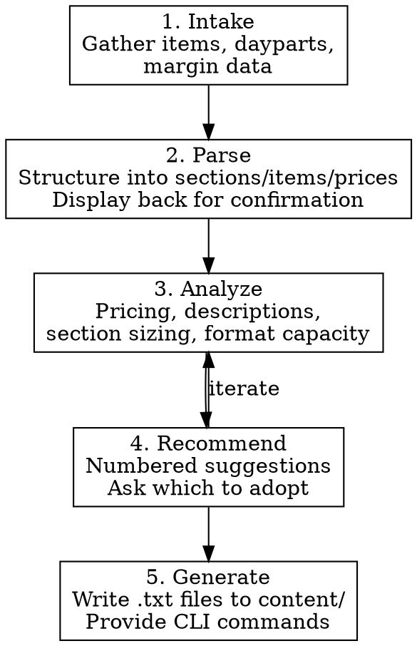

# Menu Content Engineering

## Overview

Strategic menu content optimization that sits upstream of media generation. Takes raw menu data (pasted text, files, or verbal descriptions), applies restaurant menu engineering best practices, and outputs `.txt` content files ready for `generate menu`.

**Announce at start:** "I'm using the menu-content skill to help structure and optimize your menu."

## When to Use

- Planning a new menu or restructuring existing items
- Expanding a food or drink program (adding dayparts, sections, formats)
- Asking about pricing strategy, item descriptions, or layout
- Creating seasonal, event, or specialty menus
- Deciding which format/size to use for a menu
- Splitting a large menu across multiple pages or formats

**NOT for:** User already has a finalized `.txt` file and just wants to generate visuals — use the media-generation skill directly.

## Conversational Workflow



### Step 1: Intake

Gather all menu items. Accept any input format:
- Pasted text (messy is fine)
- Path to an existing file
- Verbal description ("we have about 12 sandwiches, 8 breakfast items...")
- Photos of handwritten/printed menus

Ask about:
- **Dayparts**: Breakfast, lunch, dinner, happy hour, late night?
- **Seasonal items**: Rotating specials vs permanent?
- **Margin data**: If available, which items are high/low margin? (Use heuristics if not provided)
- **Constraints**: Number of pages/sides, must-include items, format preferences

### Step 2: Parse

Structure raw input into sections, items, prices, and descriptions. Display the parsed result back in a clean table for confirmation before proceeding.

Flag issues:
- Missing prices
- Inconsistent naming (abbreviations, capitalization)
- Items that look like duplicates
- Sections with too many or too few items

### Step 3: Analyze

Run these analyses and present findings:

**Pricing analysis:**
- Price spread within each section (flag if >2:1 ratio)
- Anchor positioning (highest-priced items placement)
- Comparison to Portland market rates (see reference below)
- Odd/even pricing consistency

**Description quality:**
- Items missing descriptions that would benefit from them (high-margin, signature items)
- Descriptions that are too long (>15 words) or too short (<3 words)
- Sensory language usage (increases willingness to pay 12-15%)
- Brand voice alignment

**Section sizing:**
- Sections over 7 items (split recommendation)
- Sections under 3 items (merge recommendation)
- Total item count vs format capacity (see reference below)

**Star/Plow/Puzzle/Dog classification** (heuristic without exact sales data):
- Stars (popular + profitable): crowd-pleasers with low protein cost
- Plows (popular + low margin): high-volume staples
- Puzzles (unpopular + profitable): need better positioning/description
- Dogs (unpopular + low margin): candidates for removal or rework

### Step 4: Recommend

Present numbered, actionable suggestions. Group by priority:

1. **Must-fix**: Items over capacity, missing prices, broken sections
2. **High-impact**: Pricing adjustments, Star repositioning, description upgrades
3. **Nice-to-have**: Description polish, section reordering, format alternatives

Ask which recommendations to adopt before generating files. Don't assume.

### Step 5: Generate

Write `.txt` content files to `content/` directory. Then provide exact CLI commands for media generation.

## Menu Engineering Reference

### Pricing Psychology

| Principle | Application |
|-----------|-------------|
| **Anchor effect** | Place highest-priced item first or second in section |
| **Decoy pricing** | A high-priced item makes the next one look reasonable |
| **Price spread** | Max 2:1 ratio within a section ($8-$16, not $6-$22) |
| **Dollar signs** | Optional for casual dining — omitting reduces price sensitivity |
| **No cents** | Use whole dollars for casual ($14, not $13.99) |
| **Nested pricing** | Use for size variants: "Single $9 / Double $13" |

### Item Placement

| Position | Effect | Best for |
|----------|--------|----------|
| **First in section** | 12-15% more orders | Stars or new items |
| **Last in section** | 10-12% more orders | High-margin items |
| **Middle of section** | Lowest attention | Plows (they sell anyway) or Dogs |
| **Boxed/highlighted** | 20-30% order increase | 1-2 featured items per page max |
| **Golden Triangle** | Highest visual attention | Middle → top-right → top-left reading pattern |

### Description Best Practices

- **Length**: 6-12 words ideal
- **Sensory language**: "crispy", "slow-roasted", "house-made" (+12-15% willingness to pay)
- **Origin/technique**: "Tillamook cheddar", "wood-fired", "48-hour brine"
- **Match brand voice**: casual, friendly, a little cheeky (Triple Lindy)
- **Skip descriptions for**: obvious items (fries, toast), low-margin basics

### Section Sizing

- **Ideal**: 5-7 items per section
- **Maximum**: 10 items (causes choice paralysis beyond this)
- **Minimum**: 3 items (fewer looks sparse — merge with adjacent section)

### Portland 2026 Price Context

| Category | Range | Premium |
|----------|-------|---------|
| Breakfast | $10-16 | $18-22 |
| Sandwiches | $12-16 | $18+ |
| Burgers | $13-18 | $20+ |
| Entrees | $14-18 | $22+ |
| Sides | $6-9 | $10-12 |
| Appetizers | $8-14 | $16+ |
| Happy hour food | $5-9 | — |

## Format Capacity Reference

Per-side estimates. Layout engine auto-scales fonts but readability degrades below ~9pt. Brand minimum body size is 10pt.

| Format | CLI key | Items w/ descriptions | Items w/o descriptions | Best for |
|--------|---------|----------------------|----------------------|----------|
| Table Tent (5x7) | `table-tent` | 6-8 | 10-12 | Happy hour, specials, cocktails |
| Half Letter (5.5x8.5) | `half-letter` | 12-16 | 18-22 | Cocktail menu, small food menu |
| Letter Portrait (8.5x11) | `letter-portrait` | 20-25 | 30-35 | Full menu, one side |
| Letter Landscape (11x8.5) | `letter-landscape` | 15-20 | 25-30 | Bar menu, tap list |
| Legal (8.5x14) | `legal` | 30-35 | 45-50 | Extended menu |

**Choosing a format:**
- Count total items (with descriptions = larger footprint)
- Pick format where item count is 70-85% of capacity (breathing room)
- If over capacity: split into front/back (`--sides 2`) or use next size up
- If way under capacity: use smaller format or remove descriptions for sparse items

## Content File Format

Must match what `src/content/content-loader.ts` parses:

```
Section Name
Item Name - $Price
Item Name - $Price (short description here)
Another Item - $Price

Next Section
Item Name - $Price (description)
Item Name - $Price
```

**Rules:**
- Blank lines separate sections
- First non-blank line after a gap (or at file start) is a section header
- Items: `Name - $Price` or `Name - $Price (description)`
- Descriptions go in parentheses after the price
- Title is set via `--title` CLI flag, not in the file
- Subtitle and footer via `--subtitle` and `--footer` CLI flags

**File naming:** `content/<brand>-<menu-type>.txt`
- `triple-lindy-main-menu.txt`
- `triple-lindy-breakfast.txt`
- `triple-lindy-happy-hour.txt`
- `triple-lindy-cocktails.txt`

**Two-sided menus:** use `-front.txt` and `-back.txt` suffixes:
- `triple-lindy-main-menu-front.txt`
- `triple-lindy-main-menu-back.txt`

## Integration with Media Generation

### Template CLI Commands

**Single-sided menu:**
```bash
npx tsx src/cli.ts generate menu \
  --brand triple-lindy \
  --input content/triple-lindy-main-menu.txt \
  --title "Main Menu" \
  --format letter-portrait \
  --text-overlay --export-pdf \
  --campaign "spring-2026"
```

**Two-sided menu:**
```bash
npx tsx src/cli.ts generate menu \
  --brand triple-lindy \
  --input content/triple-lindy-main-menu-front.txt \
  --title "Main Menu" \
  --format letter-portrait \
  --sides 2 \
  --text-overlay --export-pdf \
  --campaign "spring-2026"
```

**Small format (happy hour table tent):**
```bash
npx tsx src/cli.ts generate menu \
  --brand triple-lindy \
  --input content/triple-lindy-happy-hour.txt \
  --title "Happy Hour" \
  --subtitle "3-6pm Daily" \
  --format table-tent \
  --text-overlay --export-pdf
```

### Recommended Flags

Always recommend these:
- `--text-overlay` — crisp vector text (no AI-rendered text artifacts)
- `--export-pdf` — editable PDF for quick tweaks
- `--campaign` — groups related outputs for browsing

Mention when relevant:
- `--custom-prompt` — visual theme instructions ("tropical vibes", "dark moody bar")
- `--style` — preset looks: `vibrant`, `minimal`, `retro`, `neon`
- `--export-pptx` — editable PowerPoint (if user needs design flexibility)
- `--reference <path>` — style inspiration from an existing image
- `--subtitle` / `--footer` — additional text outside the menu items
- `--dry-run` — preview the prompt and cost estimate without generating

## Triple Lindy Current Menu Data

Reference for analyzing changes and expansions:

### Main Menu (All Day)
| Item | Price | Notes |
|------|-------|-------|
| Lindy Burger (single/double) | $9/$13 | Signature item |
| Fried Chicken Sando | $14 | |
| Grilled Chicken Sando | $15 | |
| Veggie Burger | $15 | |
| BLT | $13 | |
| Caesar Salad | $11 | |
| Italian Grinder | $15 | |
| Street Tacos | $11 | |
| Asada Tacos | $13 | |
| Quesadilla | $10 | |
| Chipotle Chicken Burrito | $16 | |
| Chicken Strips | $13 | |
| Baskets (fries/tots/rings) | $7-8 | |

### Breakfast (Until 2pm)
| Item | Price |
|------|-------|
| 2 Egg Breakfast | $15 |
| Breakfast Sandwich | $9 |
| Breakfast Burrito | $15 |

### Happy Hour (3-6pm)
| Item | Price |
|------|-------|
| Single Lindy Burger | $8 |
| Street Taco | $5 |
| Grilled Cheese | $7 |
| Half Caesar | $5 |
| Small Salad | $5 |
| Fries/Tots | $6 |
| + drink specials | — |

### Late Night
| Item | Price |
|------|-------|
| Caesar | $11 |
| Chicken Strips | $13 |
| Baskets | $7-8 |

### In-Progress Expansion
- 11 breakfast items (up from 3)
- 12+ sandwiches/burgers (expanded from current)
- Drafts located in `~/Documents/Leg Lamp LLC/08 Marketing/Menus/In Progress Menus/`

## Verification

After generating `.txt` files, verify they parse correctly:

```bash
# Test parser
node -e "import('./src/content/content-loader.ts').then(m => m.loadMenuFile('content/<file>.txt', 'Test').then(console.log))"

# Dry-run generation
npx tsx src/cli.ts generate menu \
  --brand triple-lindy \
  --input content/<file>.txt \
  --title "Test" \
  --format half-letter \
  --text-overlay --dry-run
```
